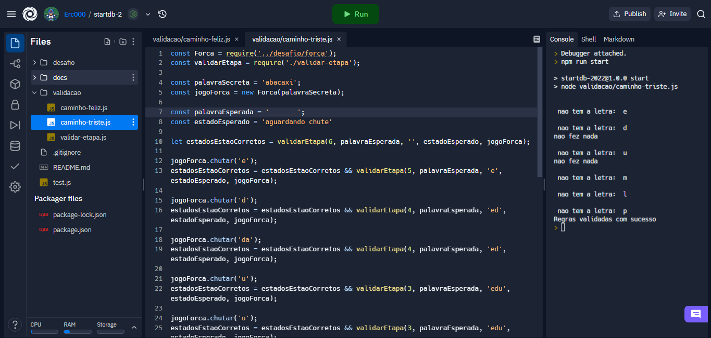
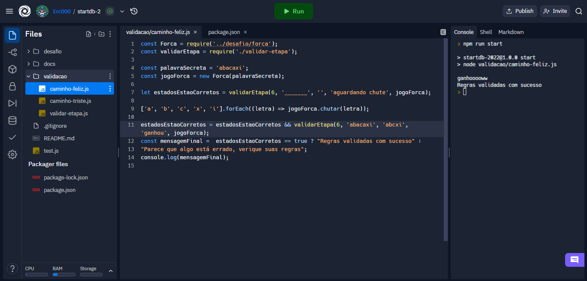

# VALIDAÇÃO

```javascript
class Forca {
  constructor(palavraSecreta) {
    this.palavraSecreta = palavraSecreta;
    this.palavra = '_'.repeat(palavraSecreta.length);
    this.vidas = 6;
    this.estado = "aguardando chute";
    this.letrasChutadas = [];
  }

  chutar(letra) {
    if (letra.length > 1 || !isNaN(letra) || this.letrasChutadas.includes(letra)) {//verifica se "letra" é maior que o esperado, se é um numero ou se ja foi chutada
      console.log('nao fez nada');
      return;
    }
    else {
      this.letrasChutadas.push(letra);//registra a letra chutada

      if (!this.palavraSecreta.includes(letra)) {//verifica se a palavra contem a letra
        console.log('\n nao tem a letra: ', letra);
        this.vidas--;

        if (this.vidas == 0) {// verifica se as vidas ja acabaram
          this.estado = "perdeu";
        }
      }
      else {
        while (this.palavraSecreta.includes(letra)) {// percorre pela string "palavra" e adiciona a letra correspondente
          this.palavra =
            this.palavra.substring(0, this.palavraSecreta.indexOf(letra))
            + letra
            + this.palavra.substring(this.palavraSecreta.indexOf(letra) + 1);

          this.palavraSecreta = this.palavraSecreta.replace(letra, "#");
        }
        if ((this.palavraSecreta.match(/#/g)).length == this.palavraSecreta.length) {//verifica se todas as letras ja foram encontradas
          this.estado = "ganhou";
          console.log("ganhooooww");
        }
      }
    }
  }

  buscarEstado() {
    return this.estado;
  } // Possiveis valores: "perdeu", "aguardando chute" ou "ganhou"

  buscarDadosDoJogo() {
    return {
      letrasChutadas: this.letrasChutadas, // Deve conter todas as letras chutadas
      vidas: this.vidas, // Quantidade de vidas restantes
      palavra: this.palavra.split('') // Deve ser um array com as letras que já foram acertadas ou o valor "_" para as letras não identificadas
    }
  }
}

module.exports = Forca;
```

## Caminho feliz



## Caminho triste



# O desafio da forca

Olá! Você está prestes a iniciar o nosso desafio para a seleção do StartDB. Se você chegou aqui sem conhecer o StartDB, você pode encontrar mais informações [neste link](https://start.dbserver.com.br/). O desafio desse ano será desenvolver as regras de um jogo da forca. 
Você conhece o jogo da forca?

 

> **Observação:** *Dia das mães* no gif acima é a dica sobre a palavra secreta

É um jogo que antigamente necessitava de duas pessoas, uma para selecionar a palavra secreta e outra para tentar acertar. A pessoa que escolhia a palavra desenhava/registrava tudo no papel, desde o desenho da forca, as letras acertadas e letras erradas. Algo muito próximo do gif acima.

> **Observação:** Somente precisa ser implementado as regras do jogo, não é preciso desenvolver a interface do jogo, o GIF é para demonstração.

# Como faço o desafio?

## Baixando o código do desafio

1. Em <i>Code</i> clique em <i>Download Zip</i>
2. Acessar o arquivo [desafio.js](https://github.com/dbserver/startdb-2022/blob/main/desafio/desafio.js)
3. Resolver os desafios que estão comentados no [arquivo de regras](docs/Regras.md)

## Ou clonando o projeto no Github:

1. Clonar projeto (Se não sabe como, acesse [aqui](https://docs.github.com/pt/github/creating-cloning-and-archiving-repositories/cloning-a-repository-from-github/cloning-a-repository))
2. Acessar o arquivo [desafio.js](https://github.com/dbserver/startdb-2022/blob/main/desafio/desafio.js)
3. Resolver os desafios que estão comentados no [arquivo de regras](docs/Regras.md)

## Instalando o Node e rodando localmente

1. Instalar o [Node](https://nodejs.org/en/)
2. Instalar dependencias do projeto com o seguinte comando:
```bash
npm install
```
3. Para interagir com o jogo durante o desenvolvimento, você pode executar `desafio.js`, que irá iniciar o jogo no terminal, com o seguinte comando:
```bash
npm start
```

## Regras do jogo

As regras estão descritas [nesse arquivo](docs/Regras.md).

# Quero enviar meu desafio, como faço :D ?

## Enviar o código fonte por e-mail:

Enviar o código fonte para o e-mail start@dbserver.com.br

## Ou subir código no GitHub:

1. Subir o código para um repositório público (Se não sabe como, acesse [aqui](https://docs.github.com/pt/github/managing-files-in-a-repository/managing-files-using-the-command-line/adding-a-file-to-a-repository-using-the-command-line))
2. Enviar o link do repositório para o e-mail start@dbserver.com.br
